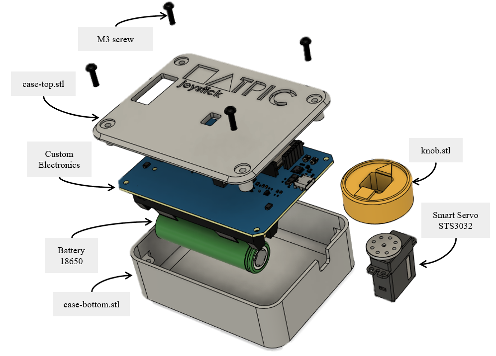

# HATPIC: An Open-Source Single Axis Haptic Joystick for Robotic Development

The only thing that is difficult with this device, is to pronounce its name.

The Hatpic device is an open source 1 Degree of Freedom (DoF) haptic joystick.

## Components

### 3D print

The device is composed of power unit and handle with a knob. All the parts are shared and can simply be 3D printed without support:
- [Bottom case](hardware/stl/case-bottom.stl)
- [Top case](hardware/stl/case-top.stl)
- [Knob](hardware/stl/knob.stl)

The knob has to be screwed on the smart servo.

### Electronics

To reach the miniaturization of this haptic device, we developed a custom PCB. It allows low-level force control of the joystick and serial communication with the computer.

- [Custom PCB](hardware/PCB/)
- STS3032 Smart servo

## How to use

The main board that embeds an ESP32 has to be flashed with the [software](firmware/hatpic/). It runs an inner loop with the force control, and communicates with a usb-c serial link with the joystick [driver](scripts/) on the computer. Communication with universal robotic tools, using ROS1 or ROS2 can be acheived.
